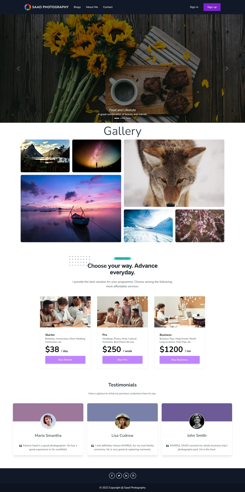

# Saad Photography

## Table of Contents

- [Overview](#overview)
  - [Screenshot](#home-page-preview)
  - [Links](#links)
- [My process](#my-process)
  - [Built with](#built-with)
  - [Features](#features)

## Overview

Welcome to my project on Single Photography Service Provider Website.

## Links

- Live Site Link: [Click Here](https://www.smart-photography-provider.web.app) to see the Live website.
- Github Repo: [Click Here](https://github.com/programming-hero-web-course-4/independent-service-provider-kamrulsaad) to check my github repo for this project.

## Home Page Preview

## My Process

I have built this website following the requirements provided.

## Built With

- `react`, `react-dom`
- `react-router`
- `firebase`
- `react-firebase-hooks`
- `tailwindCSS`
- `tw-elements`
- `react-toastify` 

## Features

Users should be able to:

- See a nice built home page
- Log in using google or facebook account
- Create account with Email and password 
- Recieve email for email-verification and resetiing password
- Browser through different pages with great user experience
- Have to accept the terms and conditions for creating an account
